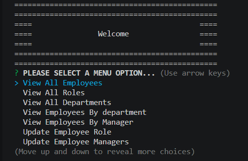
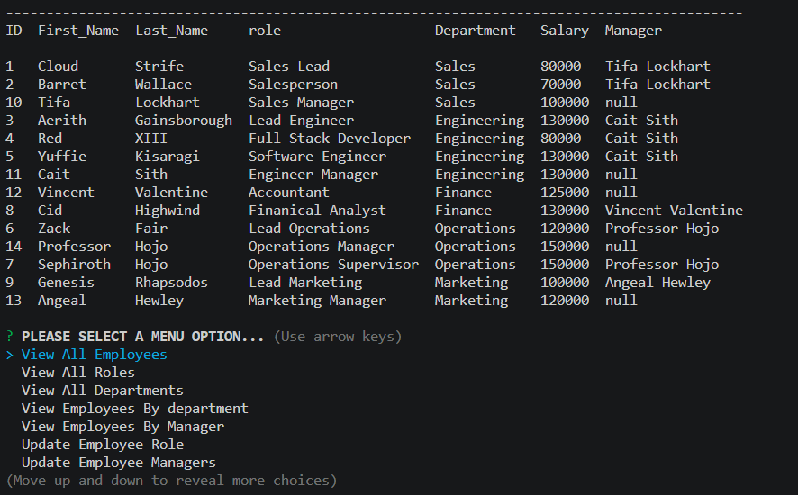

# Module 12 Challenge Employee Tracker

  

## Description
Content Management Systems (CMS) is a Node.js-based application that allows for efficient management. It utilizes an SQL database to store and retrieve employee-related data which allows business to view and manage the departments, roles and employees of their company.

## Table of Contents
1. [Installation](#installation)
2. [Technologies](#technologies)
3. [Usage](#usage)
4. [Tests](#tests)
5. [Contribution](#contribution)
6. [License](#license)
7. [Contact](#contact)

## Installation

Make sure that you have Node.js install, if you do not have node.js, you can visit [Node.js website](https://nodejs.org/en) and download node and install it onto your local computer. 

You will also need to add dpendencies, in your terminal type in,

1. `npm init -y` this will auto create a package.json to store your dependenices.

2. `npm i` this package will read the package.json file to determine which packages and their specific versions and what your project needs.

3. `npm i console.table` this package will provide an easy way to log arrays and objects as tables in the console.

4. `npm i dotev` this package will allow you to store configuration setting across different enivironments.

5. `npm i mysql2` this package will connect to your MySQL database and will perform queries.

## Technologies

  
  
  
  
  

## Usage

To run the program, in your teminal type in `npm start`

You will be given a seris of menu prompts, follow the prompts for each selection.

To exit choose the program select the option `Exit`

 Click on the link to watch a video demonstration:

## Tests

There are no unit testing written for this application

## Contribution

Created for Module 12 Challege of the U of M full stack boot camp. Contact me with ideas and request for changes.

## License
This project is licensed under the MIT License.

## Contact

 * Email: xiongxeng@gmail.com
 * Github: http://github.com/freeway9527

